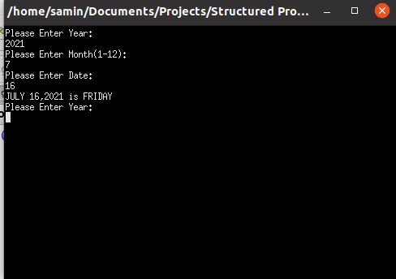
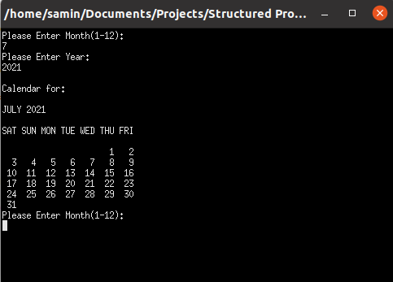

# calendar-printer
## day_finder.c
Given a Date,Month,Year calculates which weekday it was using C
### Input
* Date
* Month
* Year
### Output

## calendar_printer.c
C code to print a calendar month
### Input
* Month
* Year
### Output

